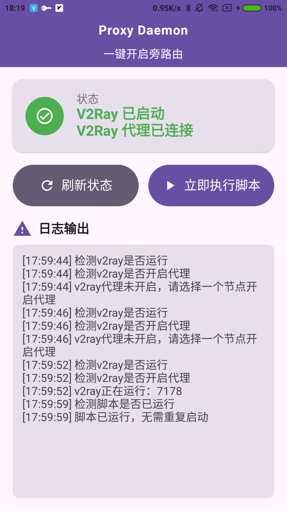
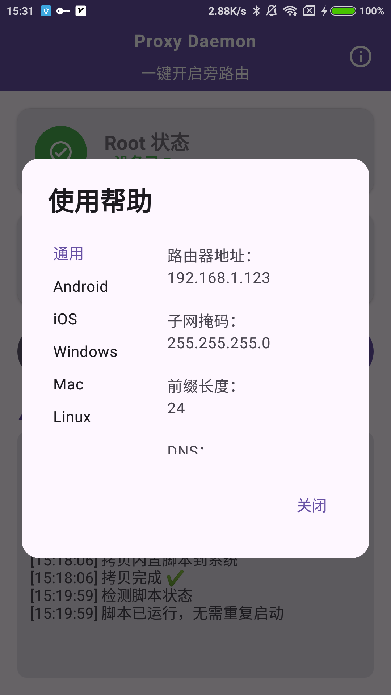
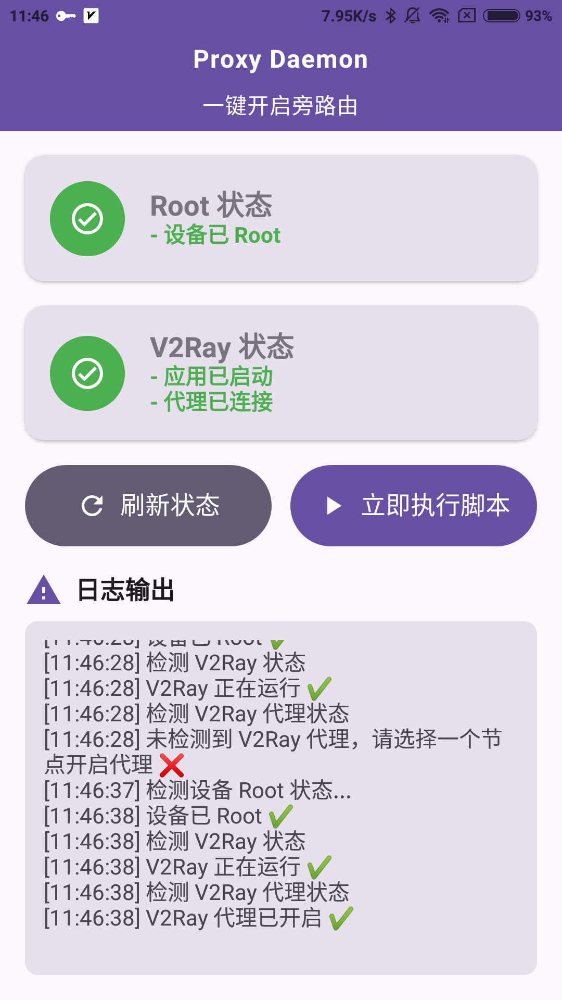

# ProxyDaemon

一个把闲置 Android 设备变成旁路由的 APP，内置[不良林](https://bulianglin.com/archives/android-gateway.html)的教程中使用的脚本。

为什么会有这个 APP。。。

因为我手机每次重启后，都需要电脑 adb shell 到手机，然后再去执行脚本，我觉得太麻烦了。


## ✨ 功能介绍

- ✅ 自动检测 V2Ray 应用以及 V2Ray 代理是否已启动
- ✅ 自动复制脚本到系统目录
- ✅ 一键执行 proxy.sh 脚本（需要 Root 权限）
- ✅ 实时日志输出


## 📦 下载

[点此下载最新版 APK](https://github.com/Sh-Fang/ProxyDaemon/releases/)  


## 📋 使用说明

### 前提条件：

- 手机已获取 Root 权限

- 手机安装了 V2ray 应用，并有可以用的节点

### 第一次使用：

- APP打开后，会把内置的脚本 proxyDaemon.sh 拷贝到 /data/local/tmp/ 并自动赋予执行权限（chmod +x）

- 点击「立即执行脚本」按钮，后台运行脚本（如果没有检测到 V2Ray，按钮会置灰无法点击）


### 刷新状态

- 启动 V2Ray 后，页面状态不会自动变化，需要手动点击「刷新状态」按钮，然后再继续操作

### 修改脚本：

- 如果需要修改脚本，可以在 assets/proxyDaemon.sh 中编写你自己的代理设置脚本


## 📕 软件截图

<p align="center">
  
  
  
</p>

## 🛠️ 自己构建APK

克隆项目

```bash
git clone https://github.com/Sh-Fang/ProxyDaemon.git
```

打开Android Studio，选择项目目录，点击 Build -> Generate Bundle/APK -> Generate APKs

构建输出路径：
```BASH
app/build/outputs/apk/release/ProxyDaemon-release-v1.x.x.apk
```


## 📝 License
[MIT License](./LICENSE) - 自由使用，注意风险自负。